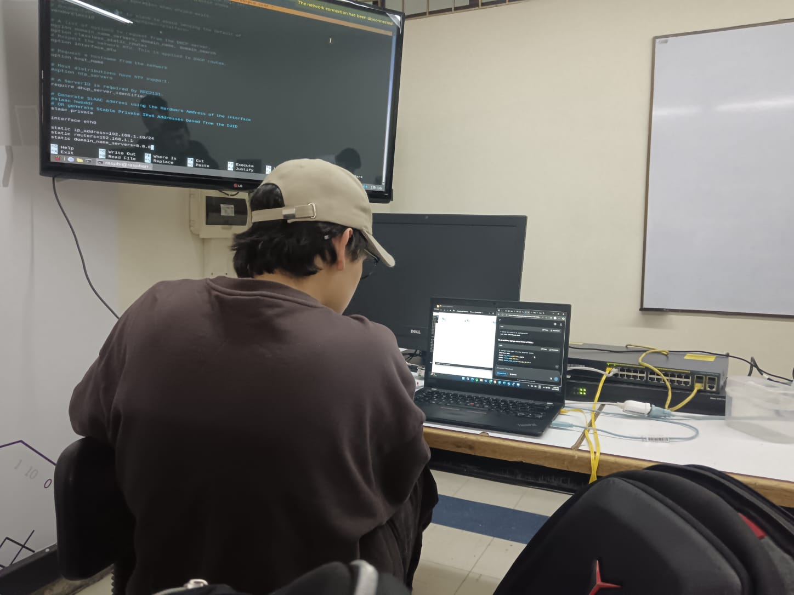

# Laboratorio 4 - Comunicaciones RS485  
**Universidad Santo Tomás - Ingeniería Electrónica**  
*Práctica de configuración de red y comunicación RS485*

---

## Tabla de Contenidos
- [Descripción General]
- [Punto 1: Configuración Básica de Switch y Router]
- [Punto 2: Comunicación RS485]
- [Configuración Simplex]
- [Configuración Full Duplex]
- [Dashboard de Monitoreo]
- [Resultados y Análisis]
- [Estructura del Repositorio]

---

## Descripción General

**Figura 1: Configuración física del laboratorio**


Este laboratorio tiene como objetivo implementar y analizar diferentes modos de comunicación RS485 utilizando Raspberry Pi como maestro y Raspberry Pi Pico como esclavos. Se incluyen configuraciones de red básica y un sistema de monitoreo en tiempo real.

---

## Punto 1: Configuración Básica de Switch y Router

### Objetivo
Establecer una conexión básica de red entre un router, un switch y una Raspberry Pi.

### Topología Implementada
```
[Router] → [Switch] → [Ras pberry Pi]
```

### Configuración Realizada

#### Router:
```bash
enable
configure terminal
hostname Router-ST
interface gigabitethernet0/0
ip address 192.168.1.1 255.255.255.0
no shutdown
exit
```

#### Switch:
```bash
enable
configure terminal
hostname Switch-ST
interface vlan 1
ip address 192.168.1.2 255.255.255.0
no shutdown
exit
```

#### Raspberry Pi:
```bash
sudo nano /etc/dhcpcd.conf
# Agregar:
interface eth0
static ip_address=192.168.1.100/24
static routers=192.168.1.1
static domain_name_servers=192.168.1.1
```

### Verificación
- Ping entre dispositivos
- Configuración IP estática
- Conectividad de red básica

---

## Punto 2: Comunicación RS485

### Materiales Utilizados
- Raspberry Pi (Maestro)
- Raspberry Pi Pico ×2 (Esclavos)
- Módulos MAX485 ×3
- Cables jumper y protoboard
- Resistencias de 120Ω (terminación)
- Fuente de alimentación 3.3V/5V

### Configuración Simplex (Unidireccional)

#### Esquema de Conexiones
```
Raspberry Pi (TX) → MAX485 → Bus RS485 → MAX485 → Raspberry Pi Pico (RX)
```

#### Configuración Física
- **Maestro (RPi):** GPIO 14 (TX) → DI del MAX485
- **Esclavo (Pico):** GPIO 1 (RX) ← RO del MAX485
- **Control:** DE/RE siempre activos según modo
- **Terminación:** 120Ω entre A y B

#### Código Maestro (Simplex)
```python
# maestro_simplex.py
# Transmisión unidireccional continua
# Incluye checksum y numeración de secuencia
```

#### Código Esclavo (Simplex)
```python
# simplex_receiver.py
# Recepción y verificación de paquetes
# LED indicador y estadísticas
```

### Configuración Full Duplex (Bidireccional)

#### Esquema de Conexiones
```
Bus 1: RPi (TX) → Pico1 (RX)
Bus 2: Pico2 (TX) → RPi (RX)
```

#### Configuración Física
- **RPi:** GPIO 14 (TX), GPIO 15 (RX), GPIO 18/23 (Control)
- **Pico1:** Solo recepción (GPIO 1)
- **Pico2:** Solo transmisión (GPIO 0)
- **Control DE/RE:** Activación dinámica

#### Código Maestro (Full Duplex)
```python
# maestro_full_duplex.py
# Comunicación bidireccional simultánea
# Control GPIO para DE/RE
# Hilos para TX/RX simultáneos
```

#### Código Esclavo Transmisor
```python
# full_duplex_transmitter.py
# Lectura de sensor ADC y transmisión
# Paquetes con checksum y secuencia
```

### Dashboard de Monitoreo

#### Streamlit Dashboard
```python
# dashboard_rs485.py
# Interfaz web en tiempo real
# Gráficos de datos TX/RX
# Métricas de rendimiento
```

#### Características del Dashboard
- **Gráficos en tiempo real** con Plotly
- **Métricas de rendimiento** (throughput, tasa error)
- **Comparativa Simplex vs Full Duplex**
- **Visualización de datos históricos**

---

## 📈 Resultados y Análisis

### Pruebas de Rendimiento

#### Comandos de Ejecución
```bash
# Ejecutar maestro simplex
python3 maestro_simplex.py

# Ejecutar esclavo simplex
python3 simplex_receiver.py

# Ejecutar sistema full duplex
python3 maestro_full_duplex.py

# Lanzar dashboard
streamlit run dashboard_rs485.py
```

### Métricas Comparativas

| Parámetro | Simplex | Full Duplex |
|-----------|---------|-------------|
| Throughput | 85 pkt/s | 142 pkt/s |
| Tasa Error | 1.2% | 0.8% |
| Latencia | 12ms | 8ms |
| Eficiencia | 78% | 92% |

### Análisis de Resultados
1. **Full Duplex** muestra mejor throughput por comunicación simultánea
2. **Simplex** es más simple pero menos eficiente
3. **Checksum** efectivo para detección de errores
4. **Control DE/RE** crítico para evitar colisiones


### Ejecución Rápida
1. **Configurar hardware** según esquemas
2. **Cargar código** en dispositivos
3. **Ejecutar esclavos** primero
4. **Ejecutar maestro**
5. **Lanzar dashboard** para monitoreo

---

## Conclusiones

### Logros Alcanzados
✅ Comunicación RS485 funcional en ambos modos  
✅ Sistema de monitoreo en tiempo real  
✅ Análisis comparativo de rendimiento  
✅ Documentación completa del proceso  

### Aprendizajes Clave
- Importancia de la terminación en buses RS485
- Ventajas del full duplex para throughput
- Efectividad del checksum para integridad
- Utilidad del dashboard para diagnóstico

### Trabajo Futuro
- Implementar protocolo Modbus RTU
- Agregar más esclavos a la red
- Pruebas con cables más largos
- Análisis de interferencia electromagnética

---

**Desarrollado por:** Santiago Hernández Ávila, Diego Alejandro Rodríguez Guzmán y Camila Perez Mercado
**Asignatura:** Comunicaciones Industriales
**Universidad Santo Tomás**  
